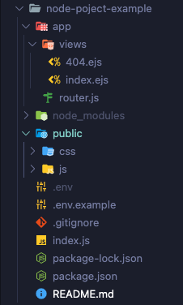

# The Node-init script

## Introduction

The `node-init` script helps developers initialize a node project quickly by automatically creating the base architecture.

##  Content

This script executes several commands for your new Node.js project. The output will be displayed in your default terminal.



This script writes the first lines of code needed. (router, '/', 404, index, etc...)


##  Install

```console
$ git clone git@github.com:AlexViard/node-init.git
```

## Initializing

```js
// In the node-init folder
$ npm install
```

## Usage

```console
$ node index 'name of the folder to create'
```

## Create an alias

To use node-init anywhere, you can create an alias with zsh. 

```
// In the .zshrc folder
alias node-init='node /path/to/the/node-init/folder/ index.js'
```

Now you can use node-init anywhere to create a project node! 

## Use node-init with alias

```
// Location where you want to create a project node
$ node-init 'name of the folder to create'


// In the node-init folder
$ npm install

// Launch the page '/' (Running in port 3000)
$ nodemon index 
```
## Support

Please file issues here at Github.

Mail: alex-viard@hotmail.fr 

Created and maintained by [Alex Viard](https://github.com/AlexViard)